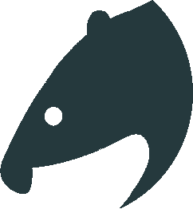

ECAL
====

<p align="center">
  
</p>

ECAL is an ECA (Event Condition Action) language for concurrent event processing. ECAL can define event-based systems using rules which are triggered by events. ECAL is intended to be embedded into other software to provide an easy to use scripting language which can react to external events.

<p>
<a href="https://void.devt.de/pub/ecal/coverage.txt"></a>
<a href="https://goreportcard.com/report/devt.de/krotik/ecal">
</a>
<a href="https://godoc.org/devt.de/krotik/ecal">
</a>
</p>

Features
--------
- Simple intuitive syntax.
- Minimalistic base language (by default only writing to a log is supported).
- Language can be easily extended either by auto generating bridge adapters to Go functions or by adding custom function into the standard library (stdlib).
- External events can be easily pushed into the interpreter and scripts written in ECAL can react to these events.
- Simple but powerful concurrent event-based processing supporting priorities and scoping for control flow.
- Handling event rules can match on event state and rules can suppress each other.

### Getting started

You can either download a pre-compiled package for Windows (win64) or Linux (amd64) [here](https://void.devt.de/pub/ecal) or clone the repository and build the ECAL executable with a simple `make` command. You need Go 1.14 or higher.

Run `./ecal` to start an interactive session. You can now write simple one line statements and evaluate them:

```
>>>a:=2;b:=a*4;a+b
10
>>>"Result is {{a+b}}"
Result is 10
```

Close the interpreter by pressing <ctrl>+d and change into the directory `examples/fib`.
There are 2 ECAL files in here:

lib.ecal
```
# Library for fib

/*
fib calculates the fibonacci series using recursion.
*/
func fib(n) {
    if (n <= 1) {
        return n
    }
    return fib(n-1) + fib(n-2)
}
```

fib.ecal
```
import "lib.ecal" as lib

for a in range(2, 20, 2) {
  log("fib({{a}}) = ", lib.fib(a))
}
```

Run the ECAL program with: `sh run.sh`. The output should be like:
```
$ sh run.sh
2000/01/01 12:12:01 fib(2) = 1
2000/01/01 12:12:01 fib(4) = 3
2000/01/01 12:12:01 fib(6) = 8
2000/01/01 12:12:01 fib(8) = 21
2000/01/01 12:12:01 fib(10) = 55
2000/01/01 12:12:01 fib(12) = 144
2000/01/01 12:12:02 fib(14) = 377
2000/01/01 12:12:02 fib(16) = 987
2000/01/01 12:12:02 fib(18) = 2584
2000/01/01 12:12:02 fib(20) = 6765
```

The interpreter can be run in debug mode which adds debug commands to the console. Run the ECAL program in debug mode with: `sh debug.sh` - this will also start a debug server which external development environments can connect to. There is a [VSCode integration](ecal-support/README.md) available which allows debugging via a graphical interface.

It is possible to package your ECAL project into an executable that can be run without a separate ECAL interpreter. Run the `sh pack.sh` and see the script for details.

### Embedding ECAL

The primary purpose of ECAL is to be a simple multi-purpose language which can be embedded into other software:
- It has a minimal (quite generic) syntax.
- By default the language can only reach outside the interpreter via return values, injecting events or logging.
- External systems can interact with the code via events which maybe be handled in sink systems with varying complexity.
- A standard library of function can easily be created by either generating proxy code to standard Go functions or by adding simple straight-forward function objects.

The core of the ECAL interpreter is the runtime provider object which is constructed with a given logger and import locator. The import locator is used by the import statement to load other ECAL code at runtime. The logger is used to process log statements from the interpreter.
```
logger := util.NewStdOutLogger()
importLocator := &util.FileImportLocator{Root: "/somedir"}
rtp := interpreter.NewECALRuntimeProvider("Some Program Title", importLocator, logger)
```
The ECALRuntimeProvider provides additionally to the logger and import locator also the following: A cron object to schedule recurring events. An ECA processor which triggers sinks and can be used to inject events into the interpreter. A debugger object which can be used to debug ECAL code supporting thread suspension, thread inspection, value injection and extraction and stepping through statements.

The actual ECAL code has to be first parsed into an Abstract Syntax Tree. The tree is annotated during its construction with runtime components created by the runtime provider.
```
ast, err := parser.ParseWithRuntime("sourcefilename", code, rtp)
```
The code is executed by calling the Validate() and Eval() function.
```
err = ast.Runtime.Validate()
vs := scope.NewScope(scope.GlobalScope)
res, err := ast.Runtime.Eval(vs, make(map[string]interface{}), threadId)
```
Eval is given a variable scope which stores the values of variables, an instance state for internal use and a thread ID identifying the executing thread.

If events are to be used then the processor of the runtime provider needs to be started first.
```
rtp.Processor.Start()
```
Events can then be injected into the interpreter.
```
monitor, err := rtp.Processor.AddEventAndWait(engine.NewEvent("MyEvent", []string{"foo", "bar"}, map[interface{}]interface{}{
  "data1": 123,
  "data2": "123",
}), nil)
```
All errors are collected in the returned monitor.
```
monitor.RootMonitor().AllErrors()
```

### Using Go plugins in ECAL

ECAL supports to extend the standard library (stdlib) functions via [Go plugins](https://golang.org/pkg/plugin/). The intention of this feature is to allow easy expansion of the standard library even with platform dependent code.

Go plugins come with quite a few extra [requirements and drawbacks](https://www.reddit.com/r/golang/comments/b6h8qq/is_anyone_actually_using_go_plugins/) and should be considered carefully. One major requirement is that `CGO_ENABLED` must be enabled because plugins use the libc dynamic linker. Using [CGO](https://blog.golang.org/cgo) means that cross-platform compilation is difficult as the compilation requires platform specific system libraries.

ECAL stdlib functions defined in plugins must conform to the following interface:
```
/*
ECALPluginFunction models a callable function in ECAL which can be imported via a plugin.
*/
type ECALPluginFunction interface {

	/*
		Run executes this function with a given list of arguments.
	*/
	Run(args []interface{}) (interface{}, error)

	/*
	   DocString returns a descriptive text about this function.
	*/
	DocString() string
}
```

There is a plugin example in the directory `examples/plugin`. The example assumes that the interpreter binary has been compiled with `CGO_ENABLED` which is the default when building the interpreter via the Makefile but not when using the pre-compiled binaries except the Linux binary. The plugin .so file can be compiled with `buildplugin.sh` (the Go compiler must have the same version as the one which compiled the interpreter binary). Running the example with `run.sh` will make the ECAL interpreter load the compiled plugin before executing the ECAL code. The example demonstrates normal and error output. The plugins to load can be defined in a `.ecal.json` file in the interpreter's root directory.

### Further Reading:

- [ECA Language](ecal.md)
- [ECA Engine](engine.md)
- [VSCode integration](ecal-support/README.md)

License
-------
ECAL source code is available under the [MIT License](/LICENSE).
